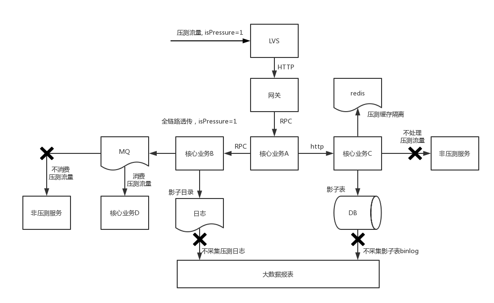

# Performance test
全链路压测相关资料

---

* [全链路压测的大概思路](https://lishoubo.github.io/2018/07/15/%E5%85%A8%E9%93%BE%E8%B7%AF%E5%8E%8B%E6%B5%8B%E7%9A%84%E5%A4%A7%E6%A6%82%E6%80%9D%E8%B7%AF/)

### 阿里
* [性能测试技术指南](https://help.aliyun.com/document_detail/29337.html?spm=a2c4g.11186623.6.659.e5293319NxlF1V)
* [史上最复杂业务场景，逼出阿里高可用三大法宝](https://zhuanlan.zhihu.com/p/27211011)
* [全链路压测-大促备战核武器](http://jm.taobao.org/2017/03/30/20170330/)
* [阿里双十一大促，技术准备只做了这两件事情？](http://jm.taobao.org/2016/12/23/20161223/)
* [独家揭秘 | 阿里怎么做双11全链路压测？](https://developer.aliyun.com/article/723177) 
* [阿里巴巴在开源压测工具 JMeter 上的实践和优化](https://mp.weixin.qq.com/s?spm=a2c6h.12873639.0.0.529232b4oIFEr9&__biz=MzU4NzU0MDIzOQ==&mid=2247487005&idx=1&sn=9c8837261ce97f69f019fe909e09e789&chksm=fdeb3c7dca9cb56b6c142d52f08eae5143cfc38bf214c2e716f65202f83ffd9325b845da48dc&scene=21#wechat_redirect)
* [10年5次进化，双11容量规划如何实现成本与稳定的最佳平衡？](https://juejin.im/entry/6844903713773977614)
* [阿里巴巴高可用技术专家襄玲：压测环境的设计和搭建](https://mp.weixin.qq.com/s?__biz=MzU4NzU0MDIzOQ==&mid=2247486698&idx=3&sn=c3a2af9322c2bf6ad25d8c4823d1461f&chksm=fdeb3e8aca9cb79c3ff4f0d61eed4db4e7fd72c54e0ef670ad9d4c12caa05000dec80bbd179a&scene=21#wechat_redirect)
* [你真的了解压测吗？实战讲述性能测试场景设计和实现](https://copyfuture.com/blogs-details/202011031831299442syvg6by3995i8n)

### 美团
* [全链路压测平台（Quake）在美团中的实践](https://tech.meituan.com/2018/09/27/quake-introduction.html)
* [大促活动前团购系统流量预算和容量评估](https://tech.meituan.com/2016/09/28/stress-test-before-promotion.html)
* [全链路压测自动化实践](https://tech.meituan.com/2019/02/14/full-link-pressure-test-automation.html)

### 滴滴
* [滴滴全链路压测解决之道](https://blog.csdn.net/g6u8w7p06dco99fq3/article/details/79119269)

### 京东
* [京东全链路压测军演系统(ForceBot)](京东全链路压测军演系统(ForceBot).pdf)
* [大促系统全流量压测及稳定性保证——京东交易架构分享（含PPT）](https://mp.weixin.qq.com/s?__biz=MzAwMDU1MTE1OQ==&mid=2653547431&idx=1&sn=744a42639e7c362a05aacbfbed6a988c&scene=21#wechat_redirect)

### 饿了么
* [饿了么全链路压测的探索与实践](https://zhuanlan.zhihu.com/p/30306892)

### 携程
* [携程全链路测试实践](携程全链路测试实践.pdf)

### 有赞
* [有赞全链路压测实战](https://cloud.tencent.com/developer/article/1510088)
* [有赞全链路压测引擎的设计与实现](https://zhuanlan.zhihu.com/p/53165467)

### 其他
* [稳定性实践：容量规划之压测系统建设](https://zhuanlan.zhihu.com/p/149538568)  
* [二十问全链路压测干货汇总(上)全网最全](http://vlambda.com/wz_7ioY4b0QfYa.html)
